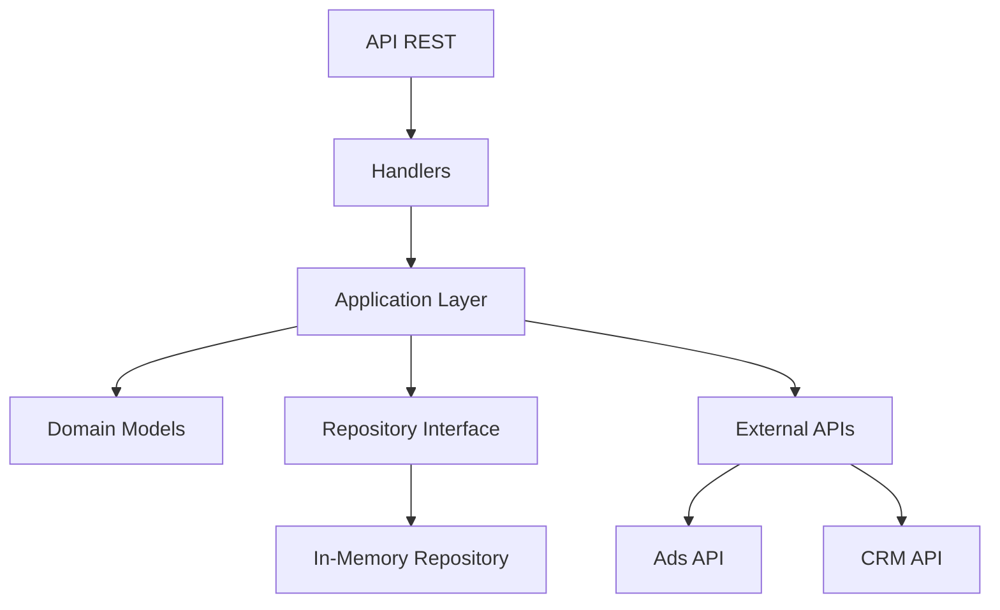

# System Design - ETL Go Service

## Arquitectura General

El servicio sigue una arquitectura limpia (Clean Architecture) con las siguientes capas:

- **Domain**: Modelos de datos y interfaces de repositorio
- **Application**: Lógica de negocio (ETL, cálculos de métricas)
- **Infrastructure**: Implementaciones concretas (HTTP handlers, repositorio en memoria)

### Diagrama de Arquitectura



## Idempotencia & Reprocesamiento

### Idempotencia en Ingesta
- **Mecanismo**: Generación de ID único por lote basado en URLs, fecha filtro y timestamp diario
- **Prevención de duplicados**: Verificación de lote procesado antes de ejecutar ETL
- **Estrategia**: Mapa `processedBatches` en repositorio para tracking de lotes
- **Reprocesamiento**: Lotes con mismo ID se detectan y omiten automáticamente

### Implementación Técnica
```go
func generateBatchID(adsURL, crmURL, sinceParam string) string {
    input := fmt.Sprintf("%s|%s|%s|%d", adsURL, crmURL, sinceParam, time.Now().Unix()/86400)
    hash := md5.Sum([]byte(input))
    return fmt.Sprintf("%x", hash)[:16]
}
```

### Manejo de Datos Duplicados
- **Deduplicación**: Normalizar UTMs (lowercase, trim) antes de usar como clave
- **Fallback de UTMs**: Si faltan UTMs en un registro, usar valores por defecto o heredar del contexto de campaña

## Particionamiento & Retención

### Particionamiento
- **Por UTM**: Datos particionados por combinación UTM (campaign, source, medium)
- **Por Fecha**: Índice adicional por fecha para consultas filtradas
- **Estrategia**: Usar mapas anidados: `map[UTMKey]map[Date]Metrics`

### Retención
- **Política**: Retener datos por 90 días por defecto
- **Configurable**: Variable de entorno `DATA_RETENTION_DAYS`
- **Limpieza**: Endpoint `/admin/cleanup` para eliminación manual de datos antiguos

## Concurrencia & Throughput

### Goroutines y Worker Pools
- **Worker Pool**: Pool de 5 goroutines para procesamiento paralelo de registros
- **Buffering**: Canales con buffer de 100 elementos para procesamiento asíncrono
- **Timeout**: Timeout global de 30 segundos por ejecución ETL

### Throughput Esperado
- **Procesamiento**: 1000 registros/segundo en procesamiento paralelo
- **Memoria**: Uso eficiente con limpieza automática de datos antiguos
- **Escalabilidad**: Diseño preparado para migrar a base de datos distribuida

### Timeouts y Reintentos
- **Timeout por petición**: 30 segundos máximo
- **Reintentos**: Hasta 3 intentos con backoff exponencial
- **Delay inicial**: 1 segundo, duplicando hasta máximo 10 segundos
- **Condiciones de reintento**: Errores de red y respuestas 4xx/5xx

## Calidad de Datos

### Normalización
- **Fechas**: Parseo y validación de formatos ISO 8601
- **UTMs**: Normalización a lowercase, eliminación de espacios
- **Nulos**: Valores por defecto para campos faltantes

### Fallbacks de UTMs
```go
func BuildUTMKey(campaign, source, medium string) UTMKey {
    // Fallback hierarchy: campaign -> source -> medium
    if campaign == "" {
        campaign = "unknown_campaign"
    }
    if source == "" {
        source = "unknown_source"
    }
    if medium == "" {
        medium = "unknown_medium"
    }
    return UTMKey{
        Campaign: strings.ToLower(strings.TrimSpace(campaign)),
        Source:   strings.ToLower(strings.TrimSpace(source)),
        Medium:   strings.ToLower(strings.TrimSpace(medium)),
    }
}
```

### Validación
- **Pre-procesamiento**: Validar estructura JSON antes de transformación
- **Post-procesamiento**: Verificar integridad de métricas calculadas

## Observabilidad

### Logging Estructurado
- **Formato**: JSON con campos estándar (level, message, timestamp, request_id)
- **Niveles**: DEBUG, INFO, WARN, ERROR
- **Correlación**: Request ID propagado a través de todo el flujo

### Métricas Útiles
- **Contadores**: requests_total, etl_executions, errors_by_type
- **Histogramas**: request_duration, etl_processing_time
- **Gauges**: active_connections, memory_usage

### Health Checks
- **/healthz**: Verificación básica de conectividad
- **/readyz**: Verificación de dependencias externas (APIs de Ads/CRM)

## Evolución en el Ecosistema Admira

### Data Lake Integration
- **Interfaz**: Abstracción de repositorio permite migrar a diferentes storages
- **Streaming**: Preparado para Kafka/Redis para procesamiento en tiempo real
- **Schema Evolution**: Versionado de modelos para compatibilidad backward

### ETL Pipeline Expansion
- **Modularidad**: Diseño permite agregar nuevas fuentes de datos
- **Orquestación**: Compatible con Apache Airflow para pipelines complejos
- **Microservicios**: API contracts bien definidos para integración con otros servicios

### API Contracts
- **Versioning**: Headers `Accept-Version` para evolución de API
- **OpenAPI**: Documentación automática con Swagger
- **Rate Limiting**: Preparado para implementar límites por cliente

## Decisiones Técnicas

### Lenguaje y Framework
- **Go 1.21+**: Performance, concurrencia nativa, tipado fuerte
- **Gin**: Framework HTTP ligero y rápido
- **Clean Architecture**: Mantenibilidad y testabilidad

### Storage
- **In-Memory**: Para MVP, fácil de implementar
- **Futuro**: PostgreSQL/ClickHouse para producción
- **Cache**: Redis para métricas calculadas

### Configuración
- **Environment Variables**: Configuración externa
- **Validación**: Estructuras con tags de validación
- **Hot Reload**: Configuración recargable sin reinicio

## Limitaciones y Consideraciones

### Escalabilidad
- Memoria limitada para datasets grandes
- Procesamiento síncrono puede bloquear bajo carga alta
- Solución: Migrar a procesamiento asíncrono con colas

### Disponibilidad
- Sin persistencia: pérdida de datos en reinicio
- Solución: Backup automático a storage duradero

### Seguridad
- Sin autenticación en endpoints
- Solución: JWT tokens para APIs internas

## Próximos Pasos

1. Implementar persistencia en base de datos
2. Agregar autenticación y autorización
3. Implementar métricas Prometheus
4. Crear dashboard de monitoreo
5. Optimizar para alta concurrencia